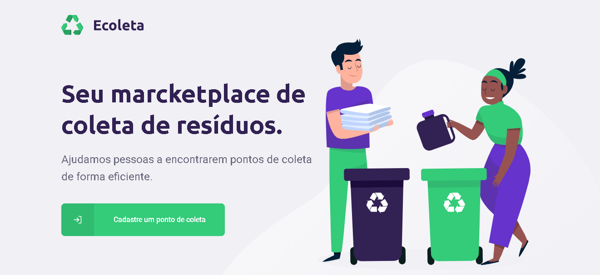
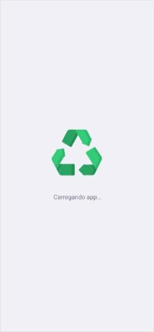
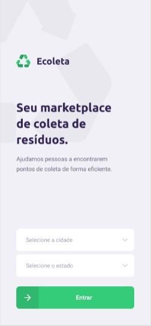
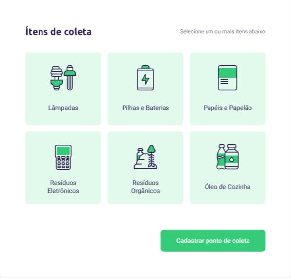
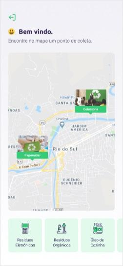
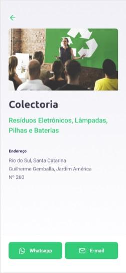

<h1 align="center">
    
</h1>

<h2 align="center"> Ecoleta is a project developed based on international environment week. That aims to connect people to companies that collect specific waste such as light bulbs, batteries, cooking oil, etc. </h2>

<h3 align="center"> Criado com a stack  React,  React Native,  Node e  MySQL </h3>

<p align="center">  </p>

<p align="center"> Using the power of a powerful stack, the use of a single popular and modern language, the  JavaScript using TypeScript. <br> Productivity, performance and security. </p>

---


The 1st edition of Next Level Week, which took place between 01/06 and 05/06, brought as a project an unprecedented web and mobile application. A system to help people locate collection points.

## To run the application

> NOTE: you can use the package manager npm or yarn to run the commands below

Run ``` npm install``` in the backend, frontend and mobile folders to install the dependencies.

Run ``` npm start``` in the backend and frontend folders to use the web version. Access via ** localhost: 3000 **.

Run ```npm start``` in the backend and mobile folders, go to ** localhost: 19002 **, read the QR Code on your phone and use the application  Expo to run the mobile version on your smartphone. Or with an Android / iOS emulator to run on your computer.

## Telas

<p align="center">
    
    
    
    
    
</p>

---

**&copy;  [Rocketseat](https://rocketseat.com.br/)**

**Instrutor: [Diego Fernandes](https://github.com/diego3g) | CTO Rocketseat**

## Licença
[MIT](https://github.com/warlenpinheiro/Be-The-Hero/blob/master/LICENSE)

---
